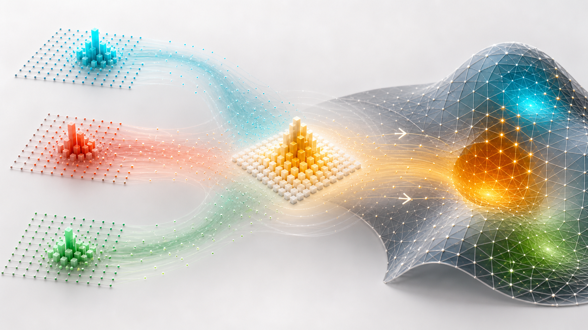
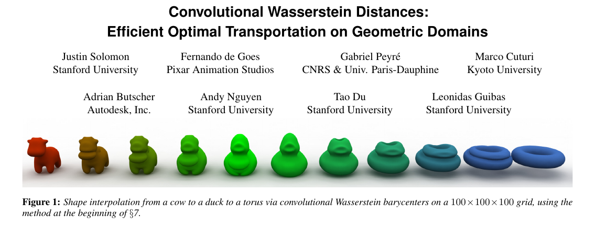
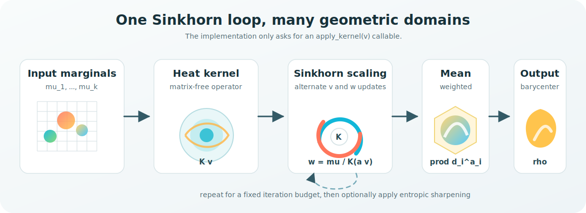

<p align="center">
  
</p>

# Convolutional Wasserstein Distances

[](https://github.com/alhussein-jamil/convolutional-wasserstein/actions/workflows/ci.yml)
[](https://github.com/alhussein-jamil/convolutional-wasserstein/blob/main/pyproject.toml)
[](https://github.com/alhussein-jamil/convolutional-wasserstein/actions/workflows/ci.yml)
[](LICENSE)

`convolutional-wasserstein` is a compact Python reimplementation of the
SIGGRAPH 2015 paper **Convolutional Wasserstein Distances: Efficient Optimal
Transportation on Geometric Domains**.

The central idea is beautifully practical: entropy-regularized optimal
transport can be solved with Sinkhorn-style scaling, and the barycenter loop
only needs to apply a kernel as `K(v)`. On regular image or voxel grids that
operator is a separable Gaussian convolution. On triangle meshes it is one
prefactored heat-equation solve. The solver in this package is therefore
domain-agnostic: swap the heat operator, keep the Wasserstein barycenter loop.

## Paper

This repo follows:

> Justin Solomon, Fernando de Goes, Gabriel Peyré, Marco Cuturi, Adrian
> Butscher, Andy Nguyen, Tao Du, and Leonidas Guibas. 2015.
> **Convolutional Wasserstein Distances: Efficient Optimal Transportation on
> Geometric Domains.** *ACM Transactions on Graphics*, 34(4), 66:1-66:11.

Links: [official PDF](https://people.csail.mit.edu/jsolomon/assets/convolutional_w2.compressed.pdf),
[HAL archive](https://hal.archives-ouvertes.fr/hal-01188953),
and [ACM DOI: 10.1145/2766963](https://dl.acm.org/doi/10.1145/2766963).

<p align="center">
  
</p>

<p align="center">
  <sub>Snapshot cropped from the official paper PDF above. Figure 1 in the paper shows 3-D shape interpolation by convolutional Wasserstein barycenters.</sub>
</p>

## How It Works

The implementation is built around `wasserstein_barycenter(...)`: provide input
probability distributions, barycentric weights, per-cell or per-vertex areas,
and a callable `apply_kernel(v)`.

<p align="center">
  
</p>

The same Sinkhorn loop can run on several domains because the expensive object
is never the dense pairwise transport matrix. It is the action of the heat
kernel on a vector.

<p align="center">
  
</p>

## What Is Included

| Path | Purpose |
| --- | --- |
| `src/convolutional_wasserstein/wasserstein.py` | Matrix-free Sinkhorn barycenters and mesh heat operator |
| `src/convolutional_wasserstein/convolution.py` | Separable Gaussian convolution for 2-D and 3-D grids |
| `src/convolutional_wasserstein/mesh.py` | Voxelized mesh distributions, cotangent Laplacian, geodesic Gaussians |
| `src/convolutional_wasserstein/post_processing.py` | Entropic sharpening from the paper |
| `scripts/` | Demo runner (`convw2`), assets, parallel grid helper, plotting |
| `notebooks/EA Convolution.ipynb` | Interactive walkthrough (original notebook) |
| `tests/` | Pytest coverage for convolution, barycenters, meshes, and sharpening |
| `data/meshes/` | Sample `.off` meshes for the 3-D demos |
| `data/images/portraits/` | Monge/Kantorovich portrait sources and processed demo PNGs |
| `data/images/shapes/` | Synthetic shape PNGs (generated on first run) |

## Install

From PyPI:

```sh
pip install convolutional-wasserstein
# or
uv add convolutional-wasserstein
```

From a local checkout ([uv](https://docs.astral.sh/uv/) recommended):

```sh
uv sync --dev    # library + tests + demo deps (matplotlib, plotly, …)
```

Runtime library only:

```sh
uv sync --no-dev
```

Demos need the `demo` dependency group (included in `--dev`):

```sh
uv sync --group demo
```

Without uv:

```sh
pip install -e ".[dev]"
```

Make shortcuts:

```sh
make dev          # uv sync --dev
make install      # uv sync --no-dev
make pre-commit   # install hooks + lint/format all files
make smoke        # pre-commit, pytest, all demos, notebook execute
```

## Repository layout

```
src/convolutional_wasserstein/   # installable library
scripts/                         # CLI demos (convw2), assets, plotting
notebooks/EA Convolution.ipynb   # interactive tutorial
tests/                           # pytest suite
data/
  meshes/                        # sample .off meshes
  images/portraits/              # portrait sources + processed PNGs
  images/shapes/                 # generated demo shapes (gitignored)
docs/assets/                     # README figures only
```

## Run Demos

Mesh assets live in `data/meshes/`. Shape and portrait PNGs are generated on
first run if missing. Outputs are written to `output/` unless `--output` is
provided.

<p align="center">
  
</p>

```sh
convw2 shapes      # 5x5 shape barycenter grid + dots-to-star gif
convw2 portrait    # grayscale portrait interpolation gif
convw2 meshes      # voxelized mesh barycenter grid and exported .off meshes
convw2 gaussian    # heat-kernel barycenter between two Gaussians on a sphere
```

Useful flags:

```sh
convw2 shapes --workers 8
convw2 meshes --output output/mesh-run -v
```

Equivalent Make targets:

```sh
make demo-shapes
make demo-portrait
make demo-meshes
make demo-gaussian
make notebook
```

Interactive notebook:

```sh
make notebook
# or: uv run jupyter lab "notebooks/EA Convolution.ipynb"
```

Portrait assets live under `data/images/portraits/`: color sources in
`raw/`, processed 202×202 grayscale PNGs at the top level. Regenerate with
`make portraits`.

## API

```python
from convolutional_wasserstein import grid_barycenter

bary = grid_barycenter(
    [mu1, mu2],
    weights=[0.5, 0.5],
    n=128,
    gamma=1e-3,
    iterations=100,
)
```

```python
import numpy as np
import scipy.linalg as slin
from convolutional_wasserstein import (
    cotangent_laplacian,
    mesh_heat_operator,
    wasserstein_barycenter,
)

laplacian, areas = cotangent_laplacian(mesh)
cholesky = slin.cholesky(np.diag(areas) + 0.5 * gamma * laplacian.toarray(), lower=True)

bary = wasserstein_barycenter(
    [mu1, mu2],
    weights=[0.5, 0.5],
    area=areas,
    apply_kernel=mesh_heat_operator(cholesky),
    iterations=50,
    sharpen=False,
)
```

## Implementation Notes

- The grid kernel is truncated at `6 * sigma`, where the discarded Gaussian
  tail is below float64 round-off for typical demo settings.
- Barycenter grids are parallelized with `ProcessPoolExecutor`; distributions
  are shared once through a worker initializer and each task sends only the
  coefficient vector.
- Mesh barycenters use either voxelized solids on a regular 3-D grid or an
  intrinsic cotangent-Laplacian heat solve for surface distributions.
- Entropic sharpening is available through `sharpen=True` on the barycenter
  routines and implemented in `post_processing.py`.

## Development

Requires [uv](https://docs.astral.sh/uv/). After `uv sync --dev`:

```sh
make test
make lint
make format
make lock    # refresh uv.lock after dependency changes
make clean
```

## Publishing

Tag a GitHub release; the publish workflow uploads to PyPI via
[trusted publishing](https://docs.pypi.org/trusted-publishers/). Configure the
PyPI trusted publisher for this repository before the first release.

## License

MIT
